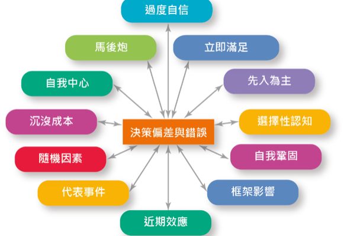

# 第六章

## 組織理性決策過程的步驟：
1. 確認問題確認決策標準
2. 決定標準權重
3. 發展解決方案
4. 分析解決方案
5. 選擇解決方案
6. 執行解決方案
7. 評估決策效能

## 決策的完全理性假設跟有限理性假設
* 完全理性的決策者：全然客觀與合乎邏輯的，他會明確界定問題，找到清楚而特定的目標，並熟悉所有可行方案及可能結果
* 有限度理性：管理者會在個人資訊處理能力的限制下，做出理性的決策

## 管理者決策常犯的偏差與錯誤有哪些

