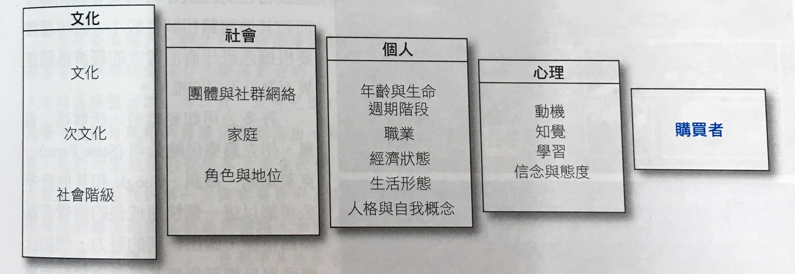

# 第五章 公司與行銷策略

* 購買者決策：消費者將選擇組合裏的品牌排出優先順序而形成購買意圖

* 消費者資訊搜尋來源：
  * 包括
    * 人際來源 (家人、朋友、鄰居、相識者)
    * 商業來源 (廣告、銷售人員、經銷商網站、包裝、陳列物)
    * 公開來源 (大眾媒體、消費者評鑑機構、網路搜尋)
    * 經驗來源 (磣品之經手、檢視、使用經驗)

* 消費者購買行為 (Consumer buyer behavior)：係指最終消費者的購買行為，包括個人與家庭購買財貨和服務作為私人消費之用

* 影響消費者行為四因素
  * 文化：由社會成員自家庭或其他重要機構學習而得的一套基本價值觀、知覺、慾望與行為 (文化，次文化：例-國籍、宗教，社會階級)
  * 社會：如消費者的小團體、家庭、社會角色與地位的影響
  * 例如：蜂鳴行銷 (Buzz marketing)：招募甚或創造公司產品的意見領袖來充當「品牌大使」，讓這些人擴散他們對產品的評論 (類病毒行銷，傳播速度快、時間短)
  * 個人：購買者的決策亦受到購買者的年齡、家庭生命週期階段、職業、經濟狀況、生活型態、個性與自我概念等個人因素的影響
  * 心理：
    * 動機 (例：佛洛伊德 潛意識理論 ＆ 馬斯洛 需求理論)
    * 知覺 (三種知覺過程：選擇性注意 -> 選擇性記憶 -> 選擇性扭曲)
    * 學習、信念 (描述性想法)
    * 態度 (評價、感覺與傾向)

* 購買決策行為之類型
  * 複雜性的購買行為：消費者高度涉入於一項購買並高度認知到品牌之間的顯著差異情況下的消費者購買行為
  * 降低認知失調的購買行為：高度涉入，但看不出各品牌之間差異時的消費者購買行為
  * 多樣化尋求的購買行為：發生在低消費者涉入但知覺品牌差異大的情況下的消費者購買行為
  * 習慣性的購買行為：低度消費者涉入，且無顯著品牌差異情況下的消費者購買行為
  * 表格：

      ||高度介入|低度介入|
      |---|---|---|
      |品牌間存在顯著的差異|複雜的購買行為|尋求多樣化的購買行為|
      |品牌間差異甚小|降低失調的購買行為|習慣性的購買行為|

* 購買者決策過程：
    > 需要察覺 -> 資訊搜尋 -> 方案評估 -> 購買決策 -> 購後行為

  * 確認需要：購買者的需要由內部刺激所引發 (例：饑餓、口渴與性) 亦有可能自外在刺激引發 (例：一則廣告或朋友的話)
  * 資訊搜尋-四個來源
    * 私人：家庭、朋友、鄰居、熟人
    * 商業性：廣告、推銷員、經銷商、包裝、產品陳列
    * 公共：大眾傳播媒體、消費者評鑑組織
    * 經驗性：操作、檢規、使用產品經驗
  * 方案評估：經由評估程序，獲得對品牌的態度

  * 購買決策：偏好和購買意向，受兩個因素的影響
    * 其他人的態度
    * 不可預期的環境因素
  * 購後行為 ：取決於消費者對產品的預期與知覺的使用效果間的關係

* 新產品的購買者決策過程：新產品的採用過程有五個階段  (`AIETA`)
  * 知曉 ( `A`wareness )：消費者聽聞或知道該新產品，但缺乏資訊
  * 興趣 ( `I`nterest )：消費者尋求該新產品之資訊
  * 評估 ( `E`valuation )：消費者考慮是否應該要試用該新產品
  * 試用 ( `T`rail )：消費者小量試用該新產品，以增進自己對產品價值的評估
  * 採用 ( `A`doption )：消費者決定全面性與經常性地使用該新產品

* 產品特性對採用率的影響 => 從產品本身來看影響的擴散速度
  * 相對優點 (相對優勢)：新產品較現有產品優越的程度
  * 調和性 (可相容性)：新產品吻合潛在顧客的價值觀和生活經驗的程度
  * 複雜性：新產品的不易了解或使用程度
  * 可分割性 (可試用性)：新產品可進行有限試用的程度
  * 溝通性 (可傳達性)：新產品使用的結果可被觀察或描述的程度